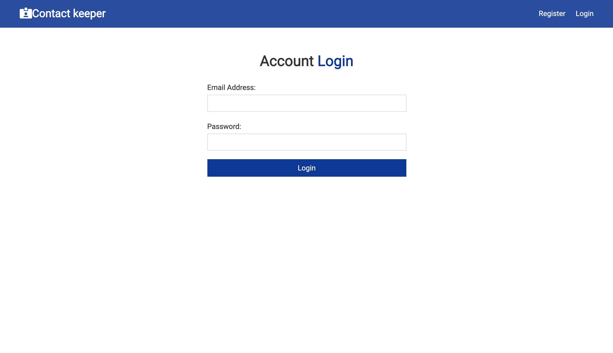

# contact-keeper-doc

--------------------------------------------------------------

--------------------------------------------------------------

- Heroku deployed URL: [https://contact-keeper-2021.herokuapp.com/login](https://contact-keeper-2021.herokuapp.com/login)

- Deployed repo: [https://github.com/DonghaoWu/contact-keeper-heroku](https://github.com/DonghaoWu/contact-keeper-heroku)

- [Part 1 - MERN stack contact keeper. :gem::gem:](https://github.com/DonghaoWu/contact-keeper-doc/blob/main/MERN-contact-keeper.md)
    - __`Code base: NEW`__ 
    - __`Doc Repo URL:`__[Contact keeper doc](https://github.com/DonghaoWu/contact-keeper-doc)
    - __`Deployed Repo URL:`__[Contact keeper heroku](https://github.com/DonghaoWu/contact-keeper-heroku)
    - __`Key Words: form fadio, useEffect, 跨 context 调用 method, mount & render, <a> & <Link> & history.push, PrivateRoute.`__

- Back to [MERN-tools-demo](https://github.com/DonghaoWu/MERN-tools-demo) navigation.