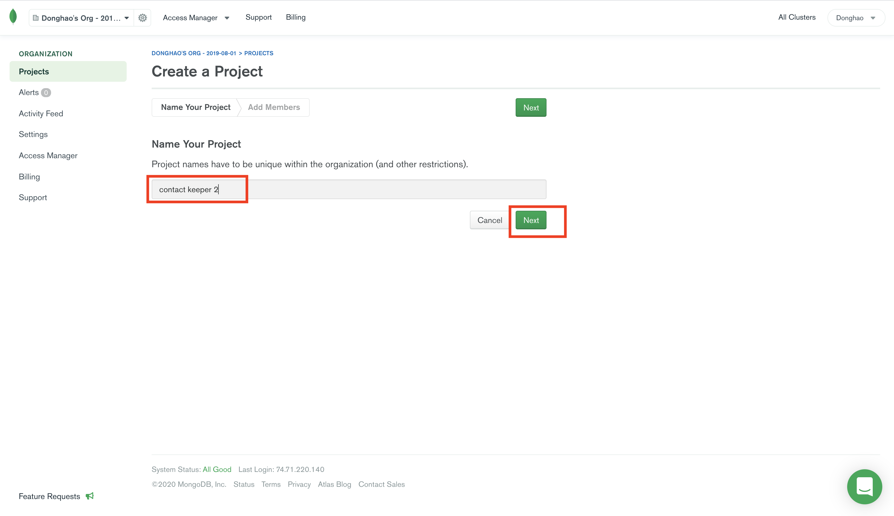
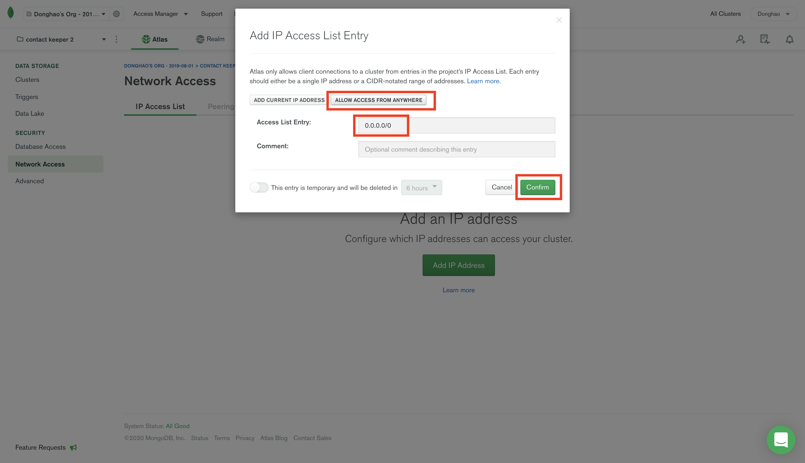

# MERN tools (Part 1)

### `Key Words: form fadio, .`

- #### Click here: [BACK TO NAVIGASTION]()

## `Section: MERN stack contact keeper.` (Advanced)

### `Summary`: In this documentation, we learn to build a MERN stack application --- contact keeper.

### `Check Dependencies & Tools:`

- Frontend
    - react
    - axios
    - react-router-dom
    - uuid
    - fontawesome library

- Backend
    - express
    - bcyptjs
    - jsonwebtoken
    - express-validator
    - mongoose
    - nodemon
    - concurrently
------------------------------------------------------------

#### `本章背景：`
1. 

------------------------------------------------------------

### <span id="1.0">`Brief Contents & codes position`</span>

- #### Click here: [BACK TO NAVIGASTION]()

- [1.1 Frontend set up.](#1.1)
- [1.2 Backend set up.](#1.2)
- [1.3 Firebase Notifications.](#1.3)
- [1.4 Firebase security.](#1.4)

------------------------------------------------------------


### <span id="1.1">`Step1: Backend set up.`</span>

- #### Click here: [BACK TO CONTENT](#1.0)

1. Initialization:

    ```bash
    $ npm init
    $ touch server.js
    $ npm i express bcryptjs jsonwebtoken express-validator mongoose dotenv
    $ npm i nodemon concurrently --save-d
    ```

2. MongoDB set up.

    1. Create a new project.

    <p align="center">
    
    </p>

    <p align="center">
    
    </p>

    <p align="center">
    
    </p>

    -----------------------------------------------------------------

    2. Build a cluster.

    <p align="center">
    
    </p>

    <p align="center">
    
    </p>

    <p align="center">
    
    </p>

    <p align="center">
    
    </p>

    -----------------------------------------------------------------

    3. Create a user.

    <p align="center">
    
    </p>

    <p align="center">
    
    </p>

    -----------------------------------------------------------------

    4. Set up white list ip address.

    <p align="center">
    
    </p>

    <p align="center">
    
    </p>

    -----------------------------------------------------------------

    5. Connetct option.

    <p align="center">
    
    </p>

    <p align="center">
    
    </p>

    -----------------------------------------------------------------

    6. Get connect string.

    <p align="center">
    
    </p>

    -----------------------------------------------------------------

3. .env file

    ```js
    JWT_SECRET=aaa

    MONGO_URI=mongodb+srv://user_example:<password>@cluster0.fowtd.mongodb.net/<dbname>?retryWrites=true&w=majority
    ```

4. db.js file

    ```js
    const mongoose = require('mongoose');
    const db = process.env.MONGO_URI;

    const connectDB = async () => {
        try {
            mongoose.connect(db, {
                useNewUrlParser: true,
                useCreateIndex: true,
                useFindAndModify: false,
                useUnifiedTopology: true
            })

            console.log('MongoDB connected...')
        } catch (err) {
            console.error(err.message);
            process.exit(1);
        }
    }

    module.exports = connectDB;
    ```

4. server.js

    ```js
    const express = require('express');
    require('dotenv').config()
    const path = require('path');
    const connectDB = require('./db');
    const PORT = process.env.PORT || 8000;

    const app = express();
    connectDB();

    app.use(express.json({ extended: true }));

    app.use(`/api/users`, require('./routes/users'));
    app.use(`/api/auth`, require('./routes/auth'));
    app.use(`/api/contacts`, require('./routes/contacts'));

    // Server static assets in production.

    if (process.env.NODE_ENV === 'production') {
        app.use(express.static('client/build'));
        app.get('*', (req, res) =>
            res.sendFile(path.resolve(__dirname, 'client', 'build', 'index.html'))
        )
    }

    app.listen(PORT, () => console.log(`Server started on port ${PORT}`));
    ```

#### `Comment:`
1. 

------------------------------------------------------------

### <span id="1.2">`Step2: Frontend set up.`</span>

- #### Click here: [BACK TO CONTENT](#1.0)

1. Install front end dependencies:

    ```bash
    $ npx create-react-app client
    $ cd client
    $ npm i axios react-router-dom
    ```

2. Add fontawesome library in index.html.

    ```html
    <script src="https://kit.fontawesome.com/2876a5e4cd.js" crossorigin="anonymous"></script>
    ```

3. Tricky error in context api:

    ```diff
    - <ContactContext.provider>
    + <ContactContext.Provider>
    ```

4. 关于 form radio 的使用。

    ```jsx
    <input
        type='radio'
        name='type'
        value='personal'
        checked={type === 'personal'}
        onChange={handleChange}
    />
    Personal{' '}
    ```

5.  不同数据共用一个 component：

    ```jsx
    <Fragment>
        {
            (filtered !== null) ?
                filtered.map(contact => {
                    return <ContactItem key={contact.id} contact={contact} />
                })
                :
                contacts.map(contact => {
                    return <ContactItem key={contact.id} contact={contact} />
                })
        }
    </Fragment>
    ```

#### `Comment:`
1. 


### <span id="1.3">`Step3: Firebase Notifications.`</span>

- #### Click here: [BACK TO CONTENT](#1.0)

1. 

#### `Comment:`
1. 

### <span id="1.4">`Step4: Firebase security.`</span>

- #### Click here: [BACK TO CONTENT](#1.0)

1. 

#### `Comment:`
1. 

__`本章用到的全部资料：`__

- null

- #### Click here: [BACK TO CONTENT](#1.0)
- #### Click here: [BACK TO NAVIGASTION](https://github.com/DonghaoWu/Frontend-tools-demo/blob/master/README.md)